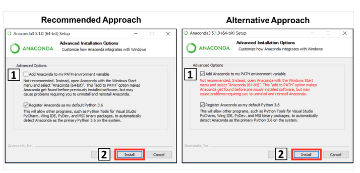

# Week 1: Setting up GitHub and Conda

This week, we will set up the tools we will use throughout the course. We will start by creating a GitHub account and a repository for the course. We will then install Miniconda and create a new environment for the course. Finally, we will export the environment to a file and push it to GitHub. We will track our progress in the milestones repository (see last section).

#### Summary of important general commands
For the following exercises we will have to use the Terminal (Mac) or Powershell (Windows). Here are some basic commands that could be helpful:

| Function | macOS/Linux Command | Windows Command |
|----------|------------------------|------------------|
| Navigate to home directory | `cd ~` | `cd %HOMEPATH%` |
| Change directory | `cd directoryName` | `cd directoryName` |
| Go up on folder | `cd ..` | `cd ..`|
| Go to **directory that has spaces**| `cd "directory Name"` | `cd "directory Name"` |
| Figure out which directory you're in | `pwd` | `pwd` |
| List files in current directory | `ls` | `dir` |
| Make a new directory | `mkdir directoryName` | `mkdir directoryName` |
| Remove a file | `rm fileName` | `del fileName` |
| Remove a directory | `rm -r directoryName` | `rd /s directoryName` |
| Copy a file | `cp sourceFileName destinationFileName` | `copy sourceFileName destinationFileName` |
| Move or rename a file | `mv sourceFileName destinationFileName` | `move sourceFileName destinationFileName` |
| Display file's contents | `cat fileName` | `type fileName` |
| Clear the command line screen | `clear` | `cls` |


#### General advice for getting used to the command line

* Whenever there is a copy-paste-able block of commands, take the time to type out each command manually. This will help you understand better what they are doing. If there's one you don't understand, search it in Google to find out what it does.
* When you run an individual command, check the output. If there is an error message, a command is likely mistyped or doesn't make sense in that specific context. Continuing with the next command will not make sense if the previous one did not run successfully.
* Understanding error messages is a really important aspect of programming in general, and is a skill that through practice can be developed over time. 

## GitHub

GitHub is a web-based platform that allows you to store and manage your code. It is widely used by developers and data scientists to collaborate on projects and share their work with others. In this course, we will be using GitHub to store and share our code, both for the exercises as well as the milestones and final assignment.

### 1. Create a GitHub account
Go to the [GitHub website](https://github.com) and sign up for an account if you don't have one already.

<details>
<summary>Detailed steps</summary>

1. Open your web browser and navigate to https://github.com/.
2. Click on the `Sign Up` button located in the top right corner of GitHub’s homepage.
3. On the next page, provide the required details including a new `Username`, a `valid Email Address` (EPFL address recommended for step 8.), and a `Password`. Make sure to verify that the password is at least 15 characters long or at least 8 characters long with a combination of letters, numbers, and symbols.
4. Review GitHub’s Terms of Service and Privacy Statement, and if you agree, click on `Create an account`.
5. Next, you might be guided through a few survey questions. You can answer them or directly click on `Complete Setup`.
6. You’ll be sent an email to the address you provided. In that email, click `Verify email address`.
7. That’s it! You should now have a GitHub account.
8. (Optional) The GitHub Student Developer Pack is a free offer from GitHub specially for students. It provides access to a variety of premium development tools and services free of charge for as long as you’re a student. [GitHub Student Developer Pack](https://education.github.com/pack)
</details>

> :trophy: **Milestone 1**
>
> Create a GitHub account. *Report in [Milestones](#milestones) by copying the link to your GitHub account.*


### 2. Configuration: Command Line Git
We usually use the command line to interact with GitHub. We will look at the most common actions but here is a [cheat sheet](https://about.gitlab.com/images/press/git-cheat-sheet.pdf) for the most common commands. Once you are finished setting up, make sure you have Git installed on your computer by typing `git --version` in your terminal.

<details>
<summary>Detailed steps</summary>

#### ❗MacOS/Linux

1. Open the Terminal app (`cmd + space` and type `terminal`). Alternatively, you can use iTerm2 or any other terminal emulator.
2. Type:
```bash
xcode-select --install
```
3. Follow the instructions to install the command line developer tools.

Continue with the [final steps](#final-steps-for-all).

#### ❗Windows

1. Download the Git **Standalone Installer** from the [official website](https://git-scm.com/download/win) ([check if your system is in 32 or 64-bit](https://helpcenter.trendmicro.com/en-us/article/tmka-14342)).
2. Open the downloaded file and follow the installation instructions.
3. Launch the Git Bash terminal from your applications.

#### Final steps for all
4. Check that Git is installed by typing `git --version` in your terminal.
5. Configure your username and email address by typing the following commands in your terminal:
```bash
git config --global user.name "Your Name" # Replace with your GitHub username
git config --global user.email "user@epfl.ch" # Replace with the associated email address
```
6. Check that your configuration was successful by typing (leave file by pressing `q`):
```bash
git config --global --list
```
</details>

### 3. Create a Profile README
A profile README is a special repository that is automatically displayed on your GitHub profile. It is a great way to introduce yourself and showcase your work. Take your time to create such a README on the GitHub website.

<details>
<summary>Detailed steps</summary>

1. On GitHub, in the upper-right corner of any page, click on the `+` and then click `New repository`.
2. Name the repository with your GitHub username (must match exactly!).
3. Select the `Public` option.
4. Check the box to `Initialize this repository with a README`.
5. Click `Create repository`.
6. Above the right sidebar, click on `Edit README` and start editing the file.
7. You can use the [GitHub Flavored Markdown](https://guides.github.com/features/mastering-markdown/) to format your README.
8. Once you are done, click on `Commit changes`.
</details>

> :trophy: **Milestone 2**
>
> Create a GitHub Profile Page. *Report the link to your personal README in [Milestones](#milestones)*

### 4. GitHub Basics: Create a Repository
Finally, we will create our first repository and update it via the command line. Please make sure to create a public repository (so the TAs can see it) and to add a README file.

#### Creating a new repository

1. Go to the GitHub website and click on the `+` in the top right corner and then `New repository`.
2. Name the repository `ppchem` and select the `Public` option. Also check the box to `Initialize this repository with a README`.

#### Create a `Personal Access Token` (PAT)

Git will ask for your password when you clone a repository (next step). In order ot increase security, GitHub requires one to add a password that is different from your login password. For that, we can create a PAT like so:

3. Go to the GitHub website and click on your profile in the upper right corner and then `⚙️ Settings`
4. Scroll to the end of the option bar on the left and click on `<> Developer settings` > `🔑 Personal access tokens` > `Tokens (classic)`
5. Next, in the upper right, click on `Generate new token` and choose the classic version.
6. Give the PAT a name and select the needed options like in the example below and then hit the `Generate token` at the bottom. 
7. **❗Copy the PAT now to a save location❗** You will need this code later when prompted for a password. It will start with `ghp_` followed by a bunch of numbers and letters.

#### Cloning the repository

8. Open your terminal and **navigate to the directory where you want to store the repository** (replace `~/git` with that folder). This is often a folder called `git` in your home directory (`~`). You have to create the folder with e.g. `mkdir git` if it does not exist yet.
```bash
cd ~/git
```
9. Type the following command to clone (download) the repository to your local machine (don't forget to replace `username` with your username):
```bash
git clone https://github.com/username/ppchem.git
```
10. Navigate into the repository by typing `cd ppchem`.

In order to clone any repository, you need to have the URL of the repository. You can find the URL by clicking on the green `Code` button on the repository's page.

#### Making changes and committing them

Whenever you make changes to your repository, you need to commit them to save the changes to the repository's history.

11. Add an image from the internet of your favorite molecule to the repository directory on your computer. Your TAs recommend `Caffeine` :coffee:. You can do this by drag and drop on your file system or by using the `mv` command shown in the [command table](#summary-of-important-general-commands) after downloading an image.
12. Type one of the following commands to stage the changes:
```bash
git add caffeine.png # stages only the added file - replace with the actual file name
git add . # stages all changes if you adapted more files
```
13. Type the following command to commit the changes:
```bash
git commit -m "Some message" # Replace with a meaningful message
```

#### Pushing the changes to GitHub

For now, we only made changes to the local repository and committed them (prepared them for upload). We need to push the changes to GitHub to make them available to others.

14. Type the following command to push the changes to GitHub:
```bash
git push origin main # Replace with the branch name if you are not on the main branch
```

You can check the status of your repository at any time by typing `git status` in your terminal in the folder of the repository. This will also show you the changes you made and the files you staged as well as the branch you are currently on.

> :trophy: **Milestone 3**
>
> commit and push a change. *Report the commit link in [Milestones](#milestones)*

#### Working with branches

15. Type the following command to create a new branch and switch to it:
```bash
git checkout -b new-branch-name
```
16. Publish the branch to GitHub by typing:
```bash
git push -u origin new-branch-name
```

Changing branches locally will change the version that you have access to locally. So if you have a specific file only in the new branch you cannot find it in `main` and therefore also not push changes from there. If you simply want to switch branch, type:
```bash
git checkout <branch-name>
```

> :trophy: **Milestone 4**
>
> Create a new branch. *Report the link to the new branch in [Milestones](#milestones)*

#### Pulling changes from GitHub

If you are working on a repository with others, you might want to pull the changes they made to your local repository. You can do this by typing `git pull` in your terminal in the folder of the repository.

### (Optional) Introduction to Pull Requests

A pull request is a important feature in collaborating with Git and GitHub. It's the way you can suggest changes you've made in a branch to be reviewed and potentially merged into another branch, usually the main branch.

Usually, pull requests are made when you've finished working on a feature or fix and you believe it's ready to be included in the main codebase. They are called 'pull requests' because you're asking the repository maintainer to 'pull' your changes.

Here's a basic flow of how to create a pull request on GitHub:

1. Fork the repository or create a new branch in the repository where you want to make changes.
2. Make your changes in your branch. This could involve editing files, adding files, or removing files.
3. Push these changes to your GitHub repository.
4. Go to the main page of the GitHub repository where you want to propose changes.
5. Click on the `Pull request` button.
6. Click on the `New pull request` button.
7. Select your fork or branch on the right dropdown menu and the main repository or branch on the left.
8. Review your changes and if everything looks good, click on the `Create pull request` button.
9. Add a title to your pull request and describe the changes you've made, then click `Create pull request`.

Once a pull request has been opened, the repository owner or collaborators can review the changes, discuss potential modifications, and even push follow-up commits if necessary.

Then, when all parties agree that the changes are ready, the owner or authorized collaborator can merge your changes into the original branch.

Remember, properly communicating what changes you've made and why you made them in the pull request description is an integral part of effective collaboration.

> :trophy: **Optional milestones 7&8**
>
> Create a pull request. *Report in [Milestones](#milestones)*
>
>Review a pull request. *Report in [Milestones](#milestones)*

#### Summary of important commands

| Command | Description |
|---------|-------------|
| `git config --global user.name "name"` | Set your name in git configuration (only once)|
| `git config --global user.email "email"` | Set your email in git configuration (only once)|
| `git clone https://github.com/username/repository.git` | Clone a GitHub repository to your local machine |
| `git branch branch-name` | Create a new branch |
| `git checkout branch-name` | Switch to another branch |
| `git add .` | Track all changes in directory |
| `git commit -m "commit message"` | Commit your tracked changes |
| `git push origin branch-name` | Push your local commits to the GitHub |
| `git pull origin branch-name` | Fetch the newest updates from the remote branch |
| `git status` | Check the status of your local repository |
| `git diff` | Show changes between your working directory and the last commit |
| `git diff --staged` | Show changes between your staging area and the last commit |

Above are the basic Git commands you'll frequently use which cover most of the general use cases from cloning repositories to making changes and updating your remote branches. Each command is a powerful tool in Git, and they are designed to work together to create a seamless workflow.

Remember, the best way to become comfortable with Git is practice. Try using these commands to manage a test project and experiment until you're confident with the functionality of each one.

## Conda

### 1. Download and install Anaconda
We will use Anaconda to manage our Python environment. Anaconda is a popular Python distribution that comes with the `conda` package manager, which allows you to install, update, and remove packages from your environment and importantly share your environment with others.

Here's how to download Anaconda:

1. Navigate to [Anaconda's download page](https://www.anaconda.com/products/distribution#Downloads).
2. Choose the graphical installer for your operating system (Windows, macOS, or Linux). ❗MacOS❗: [Check if you have an Intel or M1/M2 chip](https://help.arcstudiopro.com/all-how-tos/how-do-i-know-if-my-mac-has-intel-processor-or-apple-m1) and select the respective download.
3. Run the downloaded file and follow the installation instructions. ❗Windows❗: Once you get prompted if you want to store conda in your path **choose to add it to you `PATH`** as in the _Alternative Option_ below: 
5. Verify installation by typing `conda --version` in your Terminal or PowerShell. ❗Windows❗: If you did not add conda to your `PATH` you will have to use the `Anaconda Prompt Shell` downloaded to your applications.

### 2. Create a new environment

Having set up `conda`, we will now create a new environment for this course. We will use this environment to install the necessary packages for the exercises and the final assignment. Please make a new environment with the following properties:

- Name: `ppchem`
- Python version: `3.10`
- Packages:
    - `pandas`
    - `rdkit` (version `2022.09.5`)
    - `jupyterlab`

You can find all necessary information on what commands to use in the [conda documentation](https://docs.conda.io/projects/conda/en/latest/user-guide/tasks/manage-environments.html).

<details>
<summary>Solution: Commands</summary>
In a terminal, type the following commands:

```bash
conda create -n ppchem python=3.10
conda activate ppchem
pip install pandas  # installs numpy as dependency
pip install rdkit==2022.09.5
pip install jupyterlab
```

</details>

### 3. Export the environment to a file

Once you have installed all necessary packages, you should export the environment to a file. This file can be used by others to recreate the same environment on their computer. Please use the following command to export the environment to a file called `env.yml`. Save the environment file in the repository you created in the GitHub section and push it to GitHub.

<details>
<summary>Solution: Commands</summary>

Don't forget to reaplce `path/to/ppchem` with your path!

```bash
cd <path/to/ppchem>
git checkout main # Make sure to be on the main branch
conda activate ppchem
conda env export > env.yml
git add env.yml
git commit -m "Add environment file"
git push origin main
```

</details>

> :trophy: **Milestone 5**
>
> Create a conda environment. *Report the link to the pushed conda file in [Milestones](#milestones)*

### Some useful commands

| Command | Description |
|---------|-------------|
| `conda env list` | List all environments on your computer with their respective paths.|
| `conda activate env-name` | ctivate an environment. |
| `conda list` | List all packages installed in the activated environment. |
| `conda env remove -n env-name` | Remove an environment from your computer. |

## Milestones

We will track our progress in the milestones repository. Please fork the repository to your GitHub account and create a new branch for each milestone. Once you have completed a milestone, push the changes to your fork and create a pull request to the original repository. Your TAs will review your pull request and provide feedback if necessary. The [milestones repository](https://github.com/schwallergroup/practical-programming-in-chemistry-milestones?tab=readme-ov-file) includes all the instructions on how to use it. You can start updating once you have Git set up.

> :trophy: **Milestone 6**
>
>Fork the milestones repository
