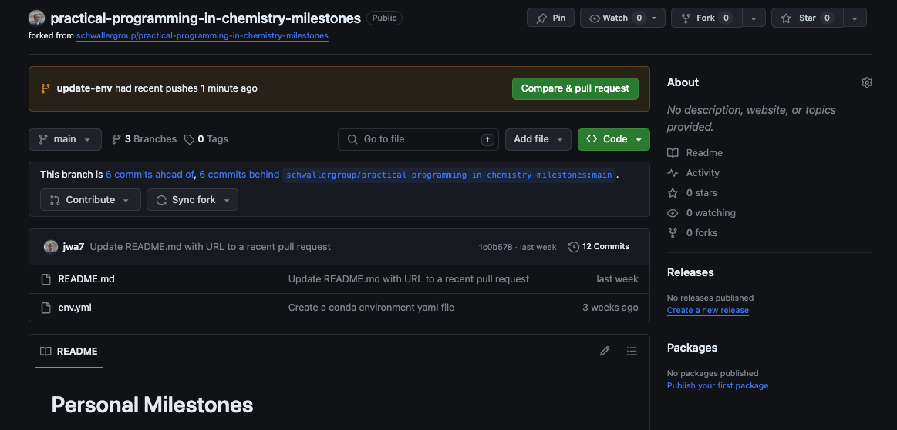
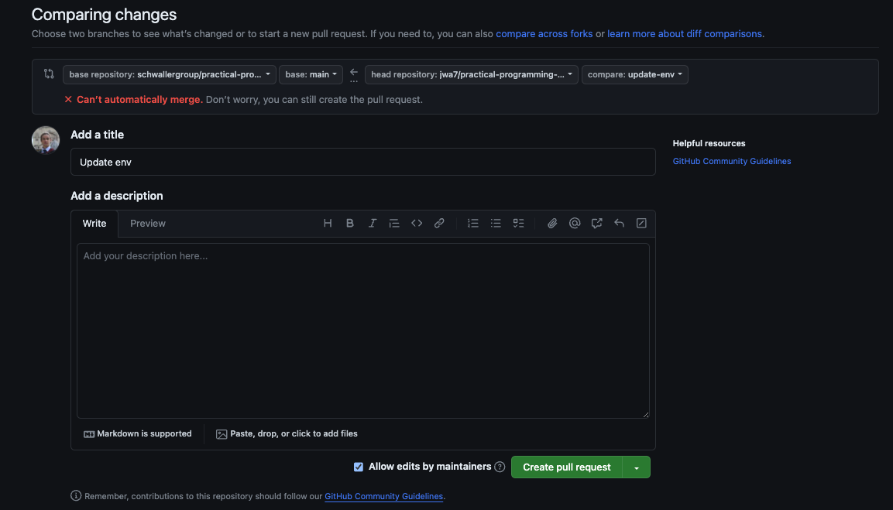
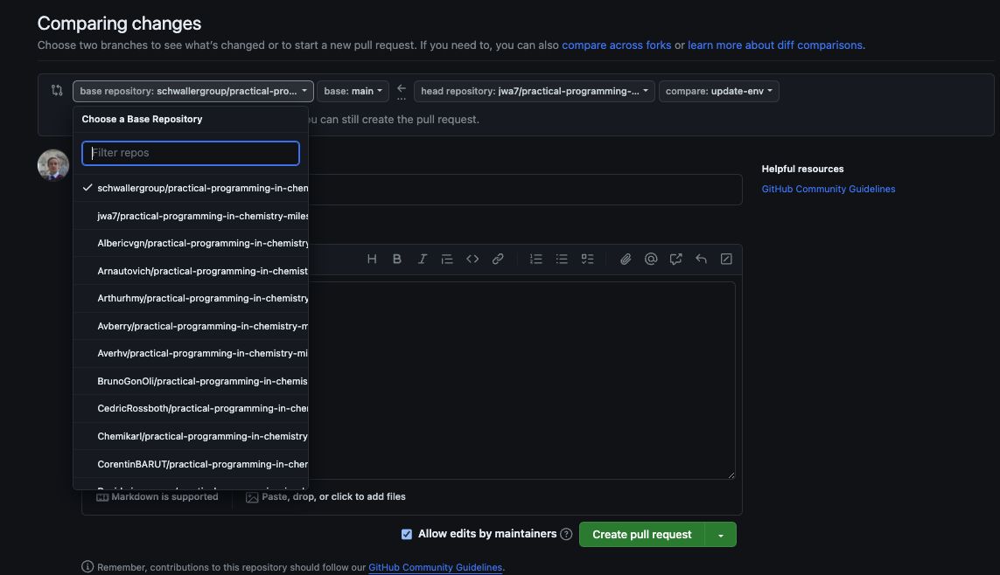
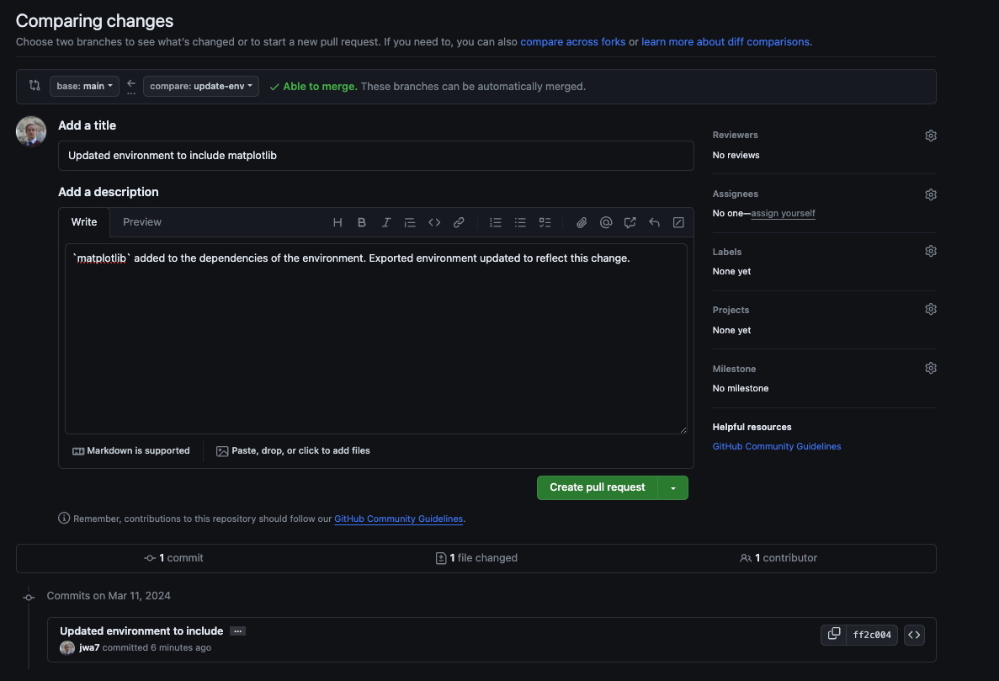

# Week 4: Setup

Welcome to week 4! Before running the exercise, we need to do a bit of set up. This week
we'll be learning about the Python modules `numpy`, `pandas`, and `matplotlib`.

If you think back to week 1, when we set up our conda environment, you'll remember that
we installed certain packages. More specifically, in the file
(week_01/README.md)[https://github.com/schwallergroup/practical-programming-in-chemistry-exercises/tree/main/week_01],
we ran the following commands:

```
conda create -n ppchem python=3.10
conda activate ppchem
pip install pandas  # installs numpy as dependency
pip install rdkit==2022.09.5
pip install jupyterlab
```

You can see that by running these, in our environment `ppchem`, we should already have
`numpy` and `pandas` installed. Open a terminal / powershell / command line prompt,
`conda activate ppchem` (or whatever you called your environment) and run the command
`conda list`. The output should look something like this (output shortened):

```
# packages in environment at /opt/miniforge3/envs/ppchem:
#
# Name                    Version                   Build  Channel
anyio                     4.2.0                    pypi_0    pypi
appnope                   0.1.4                    pypi_0    pypi
...
jupyterlab                4.1.0                    pypi_0    pypi
...
numpy                     1.26.4                   pypi_0    pypi
...
pandas                    2.2.0                    pypi_0    pypi
pandocfilters             1.5.1                    pypi_0    pypi
parso                     0.8.3                    pypi_0    pypi
pexpect                   4.9.0                    pypi_0    pypi
pillow                    10.2.0                   pypi_0    pypi
pip                       24.0               pyhd8ed1ab_0    conda-forge
...
websocket-client          1.7.0                    pypi_0    pypi
wheel                     0.42.0             pyhd8ed1ab_0    conda-forge
xz                        5.2.6                h57fd34a_0    conda-forge
```

and you should be able to see `numpy` and `pandas` there.


## Milestone: installing new packages and updating the environment file

**Note**: this section assumes that you are up to date with your milestones, and have
pushed your exported environment file to your *personal fork* of the
`practical-programming-in-chemistry-milestones` repository. If this is not the case,
make sure you have followed all of the instructions in the Week 1 exercises.

Then, follow these instructions:

1. In your terminal / powershell application, navigate to your personal
`<username>/practical-programming-in-chemistry-milestones` repository.
1. Make sure you have activated your environment: `conda activate ppchem` (or whatever
   you named your env)
1. Install the new package: `pip install matplotlib`
1. Create a new branch: `git checkout -b update-env`
1. Export the environment file: `conda env export > env.yml`
1. Inspect the changes to the environment file compared to the last commit. This can be
   done by running `git diff env.yml`. Use your arrow keys to scroll. There may be a few
   changes, but most importantly you should see a line like: `+      -
   matplotlib==3.8.3`. This tells us that, relative to the last commit, matplotlib has
   been installed in the environment, at version number `3.8.3`. Press `q` to quit the
   git diff viewer.
1. Add the changes: `git add env.yml`
1. Commit them with a meaningful message: `git commit -m "Updated environment to include
   matplotlib"`
1. Push to your fork. As the remote doesn't yet know that we have created the branch
   `update-env` locally, we need to push with: `git push --set-upstream origin
   update-env`
   
Navigate to your repository on Github, at URL:
`https://github.com/<username>/practical-programming-in-chemistry-milestones`. You should
see a green button "Compare & pull request" like below:



Click this, and you'll arrive at the `Comparing changes` screen:



As we want to update our personal fork of the repository, not the repository owned by
`schwallergroup`, we need to change the base repository to
`<username>/practical-programming-in-chemistry-milestones`



Add a short description, then click "Create pull request":



Hopefully you should see that "The branch has no conflicts with the base branch" (if
not, speak to us). You can then merge your changes into the main branch by clicking
"Merge pull request".

Finally, update the "Open a pull request" row of your Personal Milestones table with the
URL of the pull request.

For example, the URL of my (Joe's) PR was:
https://github.com/jwa7/practical-programming-in-chemistry-milestones/pull/2 


Good job! Now onto the week 4 exercises...
